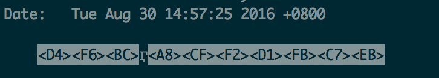

# git中文乱码怎么办

如果你在用git的时候，出现了如下画面，那我非常能感受你的心情

git中文乱码！

这个时候我应该怎么办呢？**有三件事可以做**！
1. 打开~/.bashrc文件(如果没有就新建一个), 看看下面这两句有没有，如果没有就加上，其实如果没有这两句，目录中的中文文件名，也会是乱码的

  `export LC_ALL=en_US.UTF-8`
  
  `export LANG=en_US.UTF-8`
2. 设置less的字符集，git log的结果实际上是输出给less命令，所以less的字符集也需要配置

  `export LESSCHARSET=utf-8`
3. 设置git的输出编码方式

  `git config --global i18n.logOutputEncoding utf8`
  
搞定上面这些事，应该就没有问题了，如果有问题，咱们再研究
  
